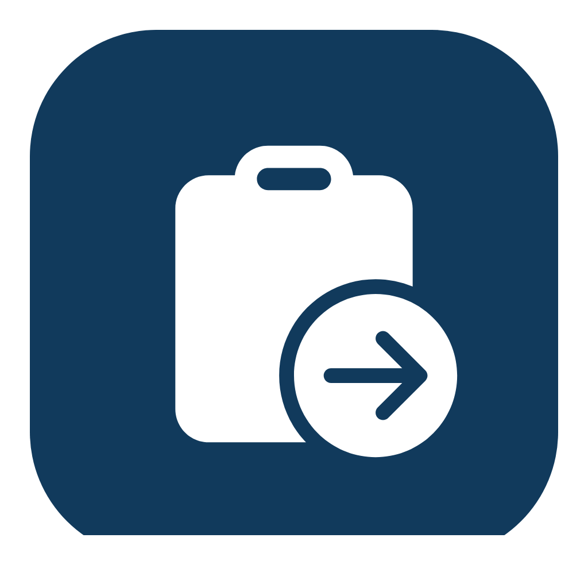

# Clipboard Sync



Local-first clipboard sync between a native Windows desktop app and an Android phone.

This repository contains:

- a native Windows tray app built with `.NET 8 + WPF + Win32 clipboard integration`
- an Android app built with `Kotlin + Jetpack Compose`
- a shared LAN-first sync protocol with secure pairing, loop prevention, image support, retry/ack handling, and persistent diagnostics

## Install Without Building

Prebuilt outputs are published in GitHub Releases for people who just want to install and test, and the local packaging workflow is kept in `dist/`.

- Latest release page:
  - `Releases` on this repository
- Release assets:
  - `ClipboardSync-android-debug.apk`
  - `ClipboardSync-windows-x64.zip`
  - `SHA256SUMS.txt`

### Android install

Using `adb`:

Download `ClipboardSync-android-debug.apk` from the latest GitHub Release, then install it with:

```powershell
adb install -r ClipboardSync-android-debug.apk
```

Or copy the APK to the phone and install it normally.

### Windows install

1. Download `ClipboardSync-windows-x64.zip` from the latest GitHub Release
2. Extract it
3. Run `ClipboardSync.App.exe`
4. If SmartScreen appears, choose `More info` -> `Run anyway`

The packaged Windows build is a self-contained preview build for `Windows x64`, so users do not need to install the .NET SDK just to run it.

## What Works

- Windows -> Android text sync
- Android -> Windows text sync
- Windows -> Android image sync
- Android -> Windows image sync where the source app exposes readable clipboard image content
- Secure pairing with a trusted peer record
- Loop prevention using event IDs + content hashes + suppression windows
- Retry and acknowledgement flow
- Recent history and diagnostics on both platforms
- Windows background / tray operation
- Android manual clipboard push button
- Android foreground notification with `Sync now`

## Important Android Limitation

Android does not reliably allow non-keyboard apps to read clipboard changes while they are hidden.

This repository handles that honestly:

- while the Android app is visible, clipboard change detection works normally
- while hidden, the foreground notification keeps the connection alive and exposes `Sync now`
- the in-app `Sync clipboard` button is the most reliable Android -> Windows path
- the notification action uses a foreground activity workaround because hidden background clipboard reads can still be blocked by Android / OEM firmware

## Quick Start

1. Start the Windows app.
2. In Windows, click `Copy Pairing Payload`.
3. In Android, paste that payload into `Manual pairing` and tap `Pair device`.
4. Keep `Keep notification active` enabled if you want the pinned `Sync now` notification.
5. Test Windows -> Android by copying text or an image on Windows.
6. Test Android -> Windows by copying something on Android and then either:
   - tapping `Sync clipboard` inside the app
   - tapping `Sync now` from the foreground notification

## Packaging Layout

- `android-app/`
  Android Studio project
- `windows-app/`
  WPF desktop project
- `shared/`
  protocol schema, fixtures, and branding sources
- `docs/`
  architecture, protocol, setup, risk register, and test matrix
- `dist/`
  local packaging layout used to produce release artifacts

## Build From Source

### Android

Requirements:

- Android Studio
- JDK 21
- Android SDK 36

Build:

```powershell
cd android-app
.\gradlew.bat assembleDebug
```

Output:

- `android-app/app/build/outputs/apk/debug/app-debug.apk`

### Windows

Requirements:

- Windows 10 or 11
- .NET 8 SDK

Build:

```powershell
dotnet build windows-app\src\ClipboardSync.App\ClipboardSync.App.csproj
```

Publish a self-contained Windows package:

```powershell
dotnet publish windows-app\src\ClipboardSync.App\ClipboardSync.App.csproj -c Release -r win-x64 --self-contained true /p:PublishSingleFile=true /p:IncludeNativeLibrariesForSelfExtract=true
```

## Logging

Windows persistent development log:

- `%LOCALAPPDATA%\ClipboardSync\logs\clipboard-sync-dev.log`

Android diagnostics are shown in-app.

## Documentation

- Architecture: `docs/architecture.md`
- Protocol: `docs/protocol.md`
- Setup notes: `docs/setup.md`
- Risk register: `docs/risk-register.md`
- Test matrix: `docs/test-matrix.md`

## Third-Party Assets

The application icon is based on Microsoft Fluent System Icons `Clipboard Arrow Right` and is documented in:

- `shared/branding/README.md`
- `THIRD_PARTY_NOTICES.md`
